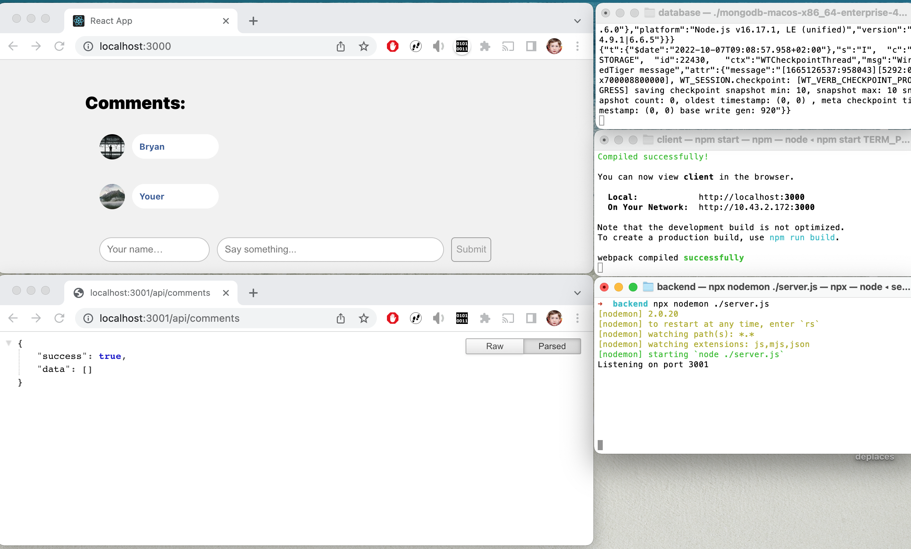

Ce tutorial est très largement inspiré de ce [billet de blog](https://medium.com/@bryantheastronaut/ok-here-we-go-b9f683c5a00c).

Il explique l'installation et les grandes lignes de fonctionnement d'une application react/node/express/mongodb ou mern. Elle suppose que les principes de framework web, de base de données et de programmation javascript sont compris. L'objectif de ce tutorial est de mettre en route rapidement une application de chat sauvegardée sous mongodb. 

Avant de démarrer ce tutorial, je vous recommande de réaliser le tutorial react qui se trouve [ici](https://reactjs.org/)

Une application mern est donc constituées de trois parties :
- Un client frontal qui gère les interactions avec l'utilisateur. Ce frontal est réalisé en react, et s'installera sur le port par défaut 3000.
- Un serveur d'API qui répondra aux requêtes réalisées par le client afin de rendre persistantes les données. Ce serveur est réalisé en node/express et s'installera sur le port par defaut 3001.
- Une base de donneés qui stockera les information de l'application. Vous utilisez une base de données mongodb qui fonctionnera sur le port spécifique 3010. 

# Zero feature application
Dans un système nécessitant la coopération de plusieurs processus. La première étape est de faire fonctionner ces processus "à vide". C'est à dire vérifier qu'on sait lancer, arrêter et surveiller le fonctionnement des processus. 
Il existe plusieurs approches pour faire fonctionner des processus. Lorsque vous avez la main directe sur l'environnement d'exploitation et sur les code des applications, je suggère d'installer les binaires ou les sources sans utiliser de gestionnaires d'installation extérieurs. Pour faire fonctionner nos trois processus (react, express, bd), il est nécessaire d'installer deux logiciels. Le gestionnaire de base de données mongodb, le runtime javascript node.
## Démarrer votre projet
Choisissez un repertoire dans lequel vous installerez l'intégralité de votre système. Supprimer ce répertoire vous permettra de redémarrer sur une installation propre. Pour ce genre d'application j'utilise un repertoire simple pour faire un `cd` dedans et sans trop de contraintes de sécurité. Par exemple `/opt`est souvent vide et disponible. 

```shell
cd /opt
mkdir -p mern/database
mkdir -p mern/backend
cd mern
```
## La base de données
Le plus compact et simple à gérer dans une première étape et de rapatrier sur sa machine l'exécutable de mongodb. Le site de mongodb est [ici](https://www.mongodb.com/try/download/enterprise). Le site demande une identification spécifique, mais si vous connaissez l'url de chargement vous pouvez directement récupérer une version avec wget. 

Voici deux exemples classiques : 
 `Mac / 64bits : wget https://downloads.mongodb.com/osx/mongodb-macos-x86_64-enterprise-4.2.23.tgz`   

 `Debian9 / 64 : wget https://downloads.mongodb.com/linux/mongodb-linux-x86_64-enterprise-debian92-4.2.23.tgz`   

Une fois votre tgz récupéré, vous pouvez installer les sources dans un sous repertoire de votre projet. 

```shell
cd database
wget https://downloads.mongodb.com/osx/mongodb-macos-x86_64-enterprise-4.2.23.tgz
tar zxvf ./mongodb-macos-x86_64-enterprise-4.2.23.tgz
rm ./mongodb-macos-x86_64-enterprise-4.2.23.tgz
```

L'archive crée un repertoire `mongodb-macos-x86_64-enterprise-4.2.23` contenant le système de gestion de données mongo. Vous pouvez lancer le serveur sur un port spécifique. (Avec une erreur).
```shell
./mongodb-macos-x86_64-enterprise-4.2.23/bin/mongod --port 3010
```
Le lancement se fait sur port 3010, mais le process se termine rapidement. Avec des lignes d'arrêt ressemblant à :
```
{"t":{"$date":"2022-10-05T10:57:20.474+02:00"},"s":"I",  "c":"FTDC",     "id":4784926, "ctx":"initandlisten","msg":"Shutting down full-time data capture"}
{"t":{"$date":"2022-10-05T10:57:20.474+02:00"},"s":"I",  "c":"CONTROL",  "id":20565,   "ctx":"initandlisten","msg":"Now exiting"}
{"t":{"$date":"2022-10-05T10:57:20.474+02:00"},"s":"I",  "c":"CONTROL",  "id":23138,   "ctx":"initandlisten","msg":"Shutting down","attr":{"exitCode":100}}
```

Au milieu des messages de log, un message indique qu'il manque l'emplacement pour stocker les fichiers de base de données. L'option --dbpath doit être ajouté au démarrage.
```
mkdir data
./mongodb-macos-x86_64-enterprise-4.2.23/bin/mongod --port 3010 --dbpath ./data
```
Le lancement doit rester en attente sur un message du style :
```
{"t":{"$date":"2022-10-05T11:25:15.020+02:00"},"s":"I",  "c":"NETWORK",  "id":23016,   "ctx":"listener","msg":"Waiting for connections","attr":{"port":3010,"ssl":"off"}}
```

Pour arrêter le serveur de base de données, il suffit d'arrêter le processus de la console par un CTRL-C. Pour supprimer la base de données et repartir d'une base vide, il suffit d'arrêter le processus, et supprimer le contenu du répertoire data.

Pour tester le moteur de base de données, il faut lancer le CLI mongo. Il permet de réaliser des commandes sur mongo à partir d'un shell interactif. Dans une nouvelle fenêtre, lancez les commandes suivantes pour créer une collection `toto` avec des données minimales. Attention ne confondez pas `mongod` le processus serveur de `mongo` le CLI. 

```shell
$ ./mongodb-macos-x86_64-enterprise-4.4.17/bin/mongo -port 3010
> db.toto.find() // Ne renvoie rien, la collection n\'existe pas
> db.toto.insert({"nom": "Stephane"}) // Insert un document dans la collection toto
> db.toto.find() // Renvoie le document inséré
> db.toto.drop() // Supprime la collection toto
```
Vous n'avez plus besoin du CLI (CTRL-C) si vous avez vérifié que votre base fonctionne. Vous pouvez en apprendre plus sur mongodb en lisant la documentation. Mais c'est inutile dans la suite du projet.

A partir de cette étape, vous savez :  
- Récupérer un tarball d'installation de mongodb
- Installer la base de données mongodb dans un répertoire isolé
- Lancer le moteur en précisant un port de connexion pour dialoguer avec et un repertoire contenant les données créées
- Supprimer toutes les bases pour repatir de zéro
- Arrêter le serveur

## NodeJs
Le backend (express) et react dépendent tous les deux d'un interpréteur javascript. Nous installons et utilisons node de manière similaire à mongodb à partir d'un tarball. 
```shell
cd /opt/mern
wget https://nodejs.org/dist/v16.17.1/node-v16.17.1-darwin-x64.tar.gz
tar xxvf ./node-v16.17.1-darwin-x64.tar.gz
rm ./node-v16.17.1-darwin-x64.tar.gz
```
A partir de maintenant on peut lancer l'interpréteur node avec la commande `./node-v16.17.1-darwin-x64/bin/node'. Faire un CTRL-C pour sortir de l'interpréteur.

## Les outils de base sont prêt
Vous avez maintenant à disposition un interpréteur node et une base de données mongo. Vous allez pouvoir installer les deux processus node nécessaires pour le front (react) et le back express. 
Pour gagner du temps et de la clareté dans les commandes, j'utiliserais directement `node` en supposant que vous l'avez ajouté à votre PATH, ou que vous le lancez avec un chemin complet ou relatif. `/opt/mern/node-v16.17.1-darwin-x64/bin/node`ou `../../nodenode-v16.17.1-darwin-x64/bin/node`.

## Installation et démarrage du front
Dans le repertoire racine mern, lancez la commande `npx create-react-app client`.
```shell
cd /opt/mern
npx create-react-app client
npm install react-markdown whatwg-fetch prop-types 
```
Cette action crée une application react vide dans un repertoire client. Puis vous propose de lancer l'application avec la commande `npm start` dans ce repertoire. Ce lancement va démarrer une application vide react, et vous proposer de lire le tutoriel.
```shell
cd /opt/mern/client
npm start
```

Remarque : vous venez d'utiliser deux outils node. `npm` est un gestionnaire de package de node qui permet d'installer et gérer des modules. `npx` permet d'exécuter un module comme un programme sans avoir à faire une installation publique commune.

# Installation du backend
Avant de démarrer le code de test de l'application il reste encore à lancer le serveur express dans le backend. 
Copiez le fichier de lancement du serveur dans le répertoire backend.

```
cd /opt/mern/backend
```

```javascript
// server.js

// first we import our dependencies…
const express = require("express");
const bodyParser = require("body-parser");
const mongoose = require("mongoose");

// and create our instances
const app = express();
const router = express.Router();

// set our port to either a predetermined port number if you have set it up, or 3001
const API_PORT = process.env.API_PORT || 3001;
// now we should configure the API to use bodyParser and look for JSON data in the request body
app.use(bodyParser.urlencoded({ extended: false }));
app.use(bodyParser.json());

// now we can set the route path & initialize the API
router.get('/', (req, res) => {
  res.json({ message: 'Hello, World!' });
});

// Use our router configuration when we call /api
app.use('/api', router);

app.listen(API_PORT, () => console.log(`Listening on port ${API_PORT}`));
```

Le serveur peut être lancé, avec la commande `node ./server.js`. Nous allons utiliser l'outil `nodemon` qui permet de relancer le serveur si un fichier de dépendance est modifié. 
```
$ npx nodemon ./server.js
```
Au premier lancement, il vous proposera d'installer le module nodemon.
Pour tester votre serveur, vous devez consulter l'url [suivante](http://localhost:3001/api). Celle-ci doit vous répondre un document json aillant la structure suivante :
```json
{
"message": "Hello, World!"
}
```

Votre Zero Feature Release est enfin prête. Elle est composée de trois processus actifs. Au plus simple ils sont lancés dans trois fenêtres de console différentes dans lesquelles les traces d'exécutions sont affichées. 
- La base de données : <database> ./bin/mongodb --dbpath=./data --port 3010
- Le front react : <client> npm start
- Le back express : <backend> npx nodemon ./server.js

Ces trois processus se lancent et s'arrêtent pas CTRL-C dans leur consoles respectives, et se testent soit par le CLI mongo pour la base de données, soit par un navigateur pointant sur [](http://localhost:3000) pour le front, soit sur [](http://localhost:3000/api/) pour le back.

Le deux démons front et back sont automatiquement relancés si les ficiers sont mis à jour. 

# L'application de gestion des chats
Elle permet de chater entre utilisateurs sur un même frontal. 
Les messages sont stockés dans une collection mongo, et accessibles par une API mongoose. 
L'application sera dévéloppée en démarrant du front, puis en ajoutant une route serveur, puis en modifiant le client pour qu'il cherche les donnée sur le serveur. 

## Le client
Pour démarrer le client nous allons réduire l'application initiale et remplacer quelques fichiers. Arrêtez l'application réact dans sa console puis supprimez les fichiers logo.svg, App.css, App.test.js, App.js, setupTests.js
```bash
cd /opt/mern/client
rm src/logo.svg src/App.css src/App.test.js src/App.js src/setupTests.js
```
Dans le fichier index.js de lancement, remplacez App par CommentBox, à l\'import et à l\'instanciation. 

```js
//index.js
import React from 'react';
import ReactDOM from 'react-dom/client';
import './index.css';
import CommentBox from './CommentBox';
import reportWebVitals from './reportWebVitals';

const root = ReactDOM.createRoot(document.getElementById('root'));
root.render(
  <React.StrictMode>
    <CommentBox />
  </React.StrictMode>
);

// If you want to start measuring performance in your app, pass a function
// to log results (for example: reportWebVitals(console.log))
// or send to an analytics endpoint. Learn more: https://bit.ly/CRA-vitals
reportWebVitals();
```

Le fichier index.js charge le composant ComponentBox. La version initiale simple est la suivante :
Le commposant charge la liste des commentaires (CommentList),
propose une interface de saisie d'un commentaire (CommentForm),
affiche des données issues d'un fichier de données,
et utilise un style d'affichage CommentBox.css.

Créez les fichiers correspondant dans le répertoire src du client.

```js
// CommentBox.js
import React, { Component } from 'react';
import CommentList from './CommentList';
//import CommentForm from './CommentForm';
import DATA from './data';
import './CommentBox.css';

class CommentBox extends Component {
  constructor() {
    super();
    this.state = { data: [] };
  }
  render() {
    return (
      <div className="container">
        <div className="comments">
          <h2>Comments:</h2>
          <CommentList data={DATA} />
        </div>
        <div className="form">
          <CommentForm />
        </div>
      </div>
    );
  }
}

export default CommentBox;
```

```js
// CommentList.js
import React from 'react';
import PropTypes from 'prop-types';
import Comment from './Comment';

const CommentList = (props) => {
  const commentNodes = props.data.map(comment => (
    <Comment author={comment.author} key={comment._id} id={comment._id}>
      { comment.text}
    </Comment>
  ));
  return (
    <div>
      { commentNodes }
    </div>
  );
};

CommentList.propTypes = {
  data: PropTypes.arrayOf(PropTypes.shape({
    author: PropTypes.string,
    id: PropTypes.string,
    text: PropTypes.string,
  })),
};

CommentList.defaultProps = {
  data: [],
};

export default CommentList;
```

```js
// Comment.js
import React from 'react';
import PropTypes from 'prop-types';
import ReactMarkdown from 'react-markdown';

const Comment = props => (
  <div className="singleComment">
    
    <div className="textContent">
      <div className="singleCommentContent">
        <h3>{props.author}</h3>
        <ReactMarkdown children={props.children} />
      </div>
      <div className="singleCommentButtons">
      </div>
    </div>
  </div>
);

Comment.propTypes = {
  author: PropTypes.string.isRequired,
  children: PropTypes.string.isRequired,
  //timestamp: PropTypes.string.isRequired,
};

export default Comment;
```

```js
// data.js
const data = [
  { _id: 1, author: 'Bryan', text: 'Wow this is neat', updatedAt: new Date(), createdAt: new Date() },
  { _id: 2, author: 'You', text: 'You\'re __right!__', updatedAt: new Date(), createdAt: new Date() },
];

export default data;
```
```css
/*CommentBox.css*/
.container {
  background-color: #f1f1f1;
  box-sizing: border-box;
  padding: 25px;
  min-height: 100vh;
  width: 100vw;
  display: flex;
  flex-flow: column nowrap;
  align-items: center;
  justify-content: space-between;

}

.comments {
  overflow: auto;
  width: 75%;
  max-width: 700px;
  min-width: 300px;
}

.comments h2 {
  font-weight: 300;
}

.singleComment {
  padding: 10px 20px;
  margin-bottom: 10px;
  display: flex;
}

.singleCommentContent {
  min-width: 100px;
  background-color: #fff;
  border-radius: 25px;
  padding: 10px;
  display: inline-flex;
}

.userImage {
  height: 35px;
  margin-right: 10px;
  border-radius: 50%;
}

.singleCommentContent h3 {
  margin: 0;
  padding-right: 5px;
  font-size: 12px;
  color: #385997;
}

.singleCommentContent p {
  font-size: 12px;
  margin: 0;
}

.singleCommentButtons {
  padding-top: 5px;
}

.time {
  font-size: 10px;
  padding-left: 5px;
  padding-right: 5px;
  color: #999;
}

.singleCommentButtons a {
  margin: 0px 3px;;
  padding-top: 10px;
  cursor: pointer;
  font-size: 10px;
  color: #385997;
  letter-spacing: 0.05em;
}

.form {
  width: 70%;
  min-width: 300px;
  max-width: 700px;
}

.form form {
  display: flex;
  padding: 15px 0;
}

.form input {
  height: 30px;
  padding-left: 10px;
  border: 1px solid #c1c1c1;
  margin-right: 10px;
  border-radius: 20px;
  flex: 3;
}

.form input:first-child {
  flex: 1;
}

.form button {
  color: #999;
  border-radius: 5px;
  border: 1px solid #999;
}

.form button:hover {
  cursor: pointer;
  color: #385997;
  border-color: #385997;
}
```
C'est le moment de relancer votre client et de corriger les bugs. Un bug est introduit dans une resolution de package qu'il faut installer à la main. Vous devez finir par obtenir une interface graphique affichant des Commentaires et une zone de saisie. La saisie ne fonctionne pas, et les commentaires sont fixés par le fihier data. 

C'est le moment de tester des choses...
Modifiez le contenu du fichier data et vérifiez que les données sont automatiquement corrigées. Supprimer les éléments de style (css) pour voir l'impact sur votre code, etc... Prenez votre temps de voir le comportement de votre chaine réact, sans impacter votre base de données. Prenez le temps de comprendre les 
différents fichiers de votre architecture initiale.

# Liaison à la base de données
Le client puise ses données dans le fichier data.js. Il est temps d'interfacer votre application `react` à votre front. 
En premier lieu nous allons connecter le backend à la base de données, déclarer le modèle de données à manipuler, puis des routes d'accès à ce modèle de données. Tout se déroule dans le backend, et pour le démarrage je suggère d'arrêter le serveur le temps de positionner les trois éléments. Un test peut être utile entre chaque éléments. 

## Réaliser la connexion 
Pour se connecter à la base de donnée, il faut démarrer le server par une connexion à mongodb. Insérer les lignes suivantes et tester.

```bash
cd /opt/mern/backend
```

```js
//server.js
...
...const API_PORT = process.env.API_PORT || 3001
...
...
mongoose.connect("mongodb://localhost:3010/");
var db = mongoose.connection;
db.on('error', console.error.('Erreur de connexion'));
```

## Ajouter le modèle dans le serveur
Créer le fichier de description moogose du schéma de commentaires. Déposez le modèle dans `model/comment.js`.

```js
//model/comment.js
const mongoose require("mongoose");
const Schema = mongoose.Schema;

// create new instance of the mongoose.schema. the schema takes an
// object that shows the shape of your database entries.
const CommentsSchema = new Schema({
  author: String,
  text: String,
}, { timestamps: true });

// export our module to use in server.js
module.exports = mongoose.model('Comment', CommentsSchema);
```

Injectez ce schema dans le serveur.
```js
//server.js
...
... const mongoose = require("mongoose");
...
const Comment = require("./model/comment");
```

Il ne reste plus qu'à ajouter une route pour l'accès client. 
Ajoutez la route de consultation suivante. 

```js
//server.js
...
...router.get('/', (req, res) => {
...  res.json({ message: 'Hello, World!' });
...});
...
router.get('/comments', (req, res) => {
  Comment.find((err, comments) => {
    if (err) return res.json({ success: false, data: {"error: err });
    return res.json({ success: true, data: comments });
  });
});
```

Vous pouvez maintenant lancer votre serveur. Pensez à lancer votre base de données avant. 
Si vous accéder à la page http://locahost:3000/api/comments, vous devriez voir le contenu de la route de message. Il n'y a pas de message dans la base de données, mais vous pouvez en injecter un avec le CLI de mongo, afin de créer dans la base une donnée fictive. `db.comment.insert({"Author":"toto", "text": "Hello"})'.

Une image de votre runtime avant insertion de données pourrait ressembler à cela. 

# Liaison Front / Backend
Le code du composant `CommandBox` est le point de synchronisation avec la base de données. Vous allez changer sa version, pour ne plus travailler sur les données du fichier local, mais puiser les données sur le serveur par un mécanisme de pulling. Toutes les deux secondes une méthode `fetch` est déclenchée pour récupérer le données. Le code suivant remplace le code initial. Prenez le temps de regarder ce qui s'y fait. Pretez attention au mécanisme de promesse nécessaire au pulling de données. 

```js
// CommentBox.js
import React, { Component } from 'react';
import 'whatwg-fetch';
import CommentList from './CommentList';
import CommentForm from './CommentForm';

class CommentBox extends Component {
  constructor() {
    super();
    this.state = {
      data: [],
      error: null,
      author: '',
      text: ''
    };
    this.pollInterval = null;
  }

  componentDidMount() {
    this.loadCommentsFromServer();
    if (!this.pollInterval) {
      this.pollInterval = setInterval(this.loadCommentsFromServer, 2000);
    }
  }

  componentWillUnmount() {
    if (this.pollInterval) clearInterval(this.pollInterval);
    this.pollInterval = null;
  }

  loadCommentsFromServer = () => {
    // fetch returns a promise. If you are not familiar with promises, see
    // https://developer.mozilla.org/en-US/docs/Web/JavaScript/Reference/Global_Objects/Promise
    fetch('http://localhost:3001/api/comments/')
      .then(data => data.json())
      .then((res) => {
        if (!res.success) this.setState({ error: res.error });
        else this.setState({ data: res.data });
      });
  }

  render() {
    return (
      <div className="container">
        <div className="comments">
          <h2>Comments:</h2>
          <CommentList data={this.state.data} />
        </div>
        <div className="form">
          <CommentForm author={this.state.author} text={this.state.text} />
        </div>
        {this.state.error && <p>{this.state.error}</p>}
      </div>
    );
  }
}

export default CommentBox;
```
Lorsque vous allez charger ce code, la compilation react sera ok, mais le code ne fonctionnera pas pour une question de sécurité. vous venez de déclencher le mécanisme CORS. (ref ?). Ce mécanisme empêche un code provenant d'une machine secondaire d'être exécuté. Dans notre cas, la machine principale est `localhost:3000` qui __livre__ le code du front, une fois le code chargée, elle réalise des requêtes sur une machine secondaire à l'adresse `localhost:3001`. Ce principe est interdit pour des questions de sécurité. Il existe de nombreuses solutions en dévelopement qui dépendent de l'architecture de production que vous souhaitez mettre en place. Dans notre exemple, nous allons dire à la machine react de réaliser les requêtes au titre du client sur le serveur du backend. En résumé, les requêtes de récupération de données, passent par le serveur réact, mais sont redispatchées vers le serveur backend. 
Pour cela, il faut corriger deux éléments :
1. Réaliser les requêtes d'appel sur le client react
2. Détourner ces appels ; ils possèdent un prefixe commun; vers le serveur de données. 

Le premier se fait en corrigeant la ligne du ComponentBox réalisant l'appel de récupération de données. 

1)
```
//ComponentBox.js
...
...loadCommentsFromServer = () => {
......// fetch returns a promise. If you are not familiar with promises, see
.....// https://developer.mozilla.org/en-US/docs/Web/JavaScript/Reference/Global_Objects/Promise
    //fetch('http://localhost:3001/api/comments/')
    fetch('/api/comments/')
...
```

2) Dans le fichier de configuration du client, /opt/mern/client/package.json, spécifier l'utilisation du proxy en dernière ligne. 

```json
,
"proxy": "http://localhost:3001"
```

A partir de maintenant le texte affiché devrait récupérer les données de la base. Vous pouvez ajouter à la main des enregistrements en base et vérifier que le client se met bien à jour. 

Le code de base peut s'arrêter là. Il met en place la chaine montante d'information des données vers le client en passant par un serveur de données. 

Nous pouvons continuer cet outil pour y intégrer les formulaires de saisie et valider une voie décendante de l'information.


# Extension de l'application pour la saisie
L'application actuelle affiche une liste de commentaires, stockés dans la base de données. Quand un commentaire est directement inséré, il est affiché quelques secondes plus tard. Nous pouvons étendre l'application pour gérer la saisie des données. Nous réalisons cet exercice de la même manière que précédemment : installer une route sur le backend, installer les composants côté client. 

## Route backend
Après la route de consultaion `get /comments`, ajoutez la route `post /comments`.

```javascript
//server.js
.... get /comments
router.post('/comments', (req, res) => {
  const comment = new Comment();
  // body parser lets us use the req.body
  const { author, text } = req.body;
  if (!author || !text) {
    // we should throw an error. we can do this check on the front end
    return res.json({
      success: false,
      error: 'You must provide an author and comment'
    });
  }
  comment.author = author;
  comment.text = text;
  comment.save(err => {
    if (err) return res.json({ success: false, error: err });
    return res.json({ success: true });
  });
});
```
Si vous avez lancé la base de données et le client react, vous pouvez tester votre route avec curl en lançant la commande suivante :

```bash
$ curl -X POST http://localhost:3001/api/comments -H 'Content-Type: application/json' -d '{"author":"George","text":"Merveilleux"}'
```

## Ajout des composants et comportement client
Nous allons décomposer cette phase en deux étapes. La première consiste à ajouter le formulaire de saisie des commentaires. La seconde à ajouter le traitement de ces données. 
Ajoutez le fichier `CommentForm.js` suivant dans votre `client/src`.

```javascript
// CommentForm.js
import React from 'react';

const CommentForm = props => (
  <form onSubmit={props.submitNewComment}>
    <input
      type="text"
      name="author"
      placeholder="Your name…"
      value={props.author}
      onChange={props.handleChangeText}
    />
    <input
      type="text"
      name="text"
      placeholder="Say something..."
      value={props.text}
      onChange={props.handleTextChange}
    />
    <button type="submit">Submit</button>
  </form>
);

CommentForm.defaultProps = {
  text: '',
  author: '',
};

export default CommentForm;
```

Puis injecter ce formulaire dans la page de gestion des commentaires `CommentBox.js`. 

```javascript
//CommentBox
....import
import CommentForm from './CommentForm';
...
...  render() {
...    return (
...   <div className="container">
...     <div className="comments">
...       <h2>Comments:</h2>
...       <CommentList data={this.state.data} />
...     </div>
    <div className="form">
      <CommentForm 
            author={this.state.author}
            text={this.state.text}
            handleChangeText={this.onChangeText}
            submitNewComment={this.submitNewComment}
      />
    </div>
```

La page s'affiche maintenant avec un formulaire de saisie. 

Si vous ouvrez la console du navigateur, vous verez deux erreurs concernant les fonctions de traitement de la saisie `submitNewComment` et `handleChangeText`  et , qu'il faut ajouter dans le fichier `CommentBox.js` 

Nous ajoutons le traitement de ces deux fonctions dans `CommentBox.js`.

```javascript
... componentWillUnmount

  onChangeText = (e) => {
    const newState = { ...this.state };
    newState[e.target.name] = e.target.value;
    this.setState(newState);
  }

  submitNewComment = (e) => {
    e.preventDefault();
    const { author, text } = this.state;
    const data = [...this.state.data, { author, text, _id: Date.now().toString() }];
    this.setState({ data });
    fetch('/api/comments', {
      method: 'POST',
      headers: { 'Content-Type': 'application/json' },
      body: JSON.stringify({ author, text }),
    }).then(res => res.json()).then((res) => {
      if (!res.success) this.setState({ error: res.error.message || res.error });
      else this.setState({ author: '', text: '', error: null });
    });
  }
```

L'application peut maintenant ajouter des commentaires.

# Dernière version 
Enfin une dernière version (v3) est disponible pour tester des fonctionnalités liées à la modification et l'horodatage des commentaires.

Vous pouvez tester l'évolution du code.